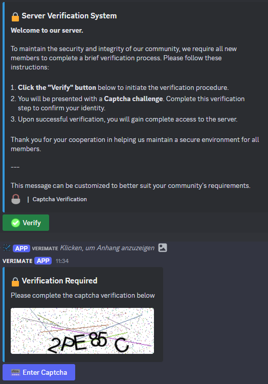

# Discord Captcha Bot
<div align="center">
  


**A powerful, customizable solution to protect your Discord server from bots and raids**

[](https://github.com/yourusername/discord-captcha-bot)
[](LICENSE)
[](https://www.python.org/)
[](https://discordpy.readthedocs.io/en/stable/)
</div>

## 🛡️ Features
- **Visual CAPTCHA Verification**: Image-based CAPTCHAs with random characters and distortion effects
- **Role Integration**: Automatically assigns verified role upon successful verification
- **Timeout Protection**: Configurable timeout periods for failed verification attempts
- **Customizable Settings**: Adjust CAPTCHA complexity, appearance, and verification parameters
- **Persistent Verification**: Database-driven system that maintains verification status
- **Interactive UI**: Modern interface with custom embeds and interactive buttons

## 📋 Requirements
- Python 3.8 or higher
- discord.py 2.0 or higher
- Pillow (PIL)
- SQLite3

## ⚙️ Installation
1. **Clone the repository**
   ```bash
   git clone https://github.com/yourusername/discord-captcha-bot.git
   cd discord-captcha-bot
   ```

2. **Install dependencies**
   ```bash
   pip install discord.py pillow
   ```

3. **Configure the bot**
   - Create a new application in the [Discord Developer Portal](https://discord.com/developers/applications)
   - Create a bot user and copy your token
   - Add the token to your bot's main file

4. **Start the bot**
   ```bash
   python bot.py
   ```

## 🔧 Configuration
The bot configuration is stored in `verify_config.json`:

```json
{
  "verified_role_id": 1342506397526655046,
  "captcha_settings": {
    "length": 6,
    "width": 280,
    "height": 90,
    "font_size": 40,
    "font_path": "arial.ttf"
  },
  "verification_settings": {
    "max_attempts": 5,
    "timeout_minutes": 10,
    "db_filename": "captcha_verification.db"
  },
  "messages": {
    "welcome": "Welcome to the server. Please complete the captcha verification process to gain access.",
    "already_verified": "Your account has already been verified on this server.",
    "verification_success": "Verification completed successfully. You now have full access to the server.",
    "verification_failed": "The captcha entry was incorrect. Please attempt verification again.",
    "verification_timeout": "Maximum verification attempts exceeded. Please try again after the timeout period."
  }
}
```

## 📚 Commands
| Command | Description |
|---------|-------------|
| `!setup_verification` | Creates a verification system in the current channel |

## 🖼️ Preview
<div align="center">
  
</div>

## 📊 Verification System Flow
1. User clicks the "Verify" button on the verification message
2. Bot sends a CAPTCHA image in an ephemeral (private) message
3. User enters the CAPTCHA text in the modal dialog
4. If correct, user receives the verified role and gains access
5. If incorrect, user can retry (up to configured maximum)
6. After too many failures, a timeout period is enforced

## 🔗 Links
- Contact: Discord username `jonas.redstone` (DMs open)
- [Report Bugs](https://github.com/yourusername/discord-captcha-bot/issues)

## 🤝 Contributing
Contributions are welcome! Please feel free to submit a Pull Request.

1. Fork the repository
2. Create your feature branch
3. Commit your changes
4. Push to the branch
5. Open a Pull Request

---
<div align="center">
  
Made with ❤️ by Jonas
</div>
